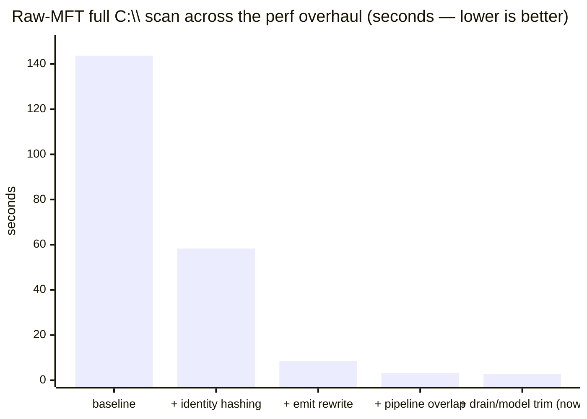

# WinBlaze

A blazingly fast disk usage analyzer for Windows that leverages NTFS internals for real-time insight into where your space went.

## Overview

WinBlaze combines a Rust scanning engine (raw NTFS MFT access with a parallel directory-walk fallback) with a C++/WinRT WinUI 3 frontend: a live expandable folder tree, a GPU-accelerated squarified treemap colored by extension, and instant search over a persistent index — wrapped in the **High Velocity** design system.

### Key Features

- **Live folder tree**: directories appear in the tree *as the scan discovers them*, with full size rollups landing the moment the scan completes
- **Real NTFS MFT scanning**: raw-volume Master File Table reader (boot-sector geometry, runlist extents, USA fixups) with correct handling of deleted records, named streams, extension records, and hardlinks
- **Hierarchical treemap**: squarified, extension-colored Direct2D tiles with progressive deepening that never stalls the UI thread
- **Persistent indexing**: compact binary snapshots reload instantly; incremental rescans diff against the previous state
- **Memory disciplined**: file paths are derived (not stored) per record — a 2.2M-file index fits in ~1 GB working set and a 323 MB snapshot
- **Responsive by measurement**: the UI ships its own frame/flush latency counters, and scan-time work is budgeted per frame

## Performance

Measured on the live `C:\` system volume — **~2.3M files / ~546k directories / 464 GB** — Windows 11, NVMe, warm cache (see [docs/REAL_WORLD_CALIBRATION.md](docs/REAL_WORLD_CALIBRATION.md) for methodology and [benchmarks/perf-overhaul-baselines.md](benchmarks/perf-overhaul-baselines.md) for the step-by-step numbers):

```mermaid
xychart-beta
    title "Engine internals across the optimization cycles (lower is better)"
    x-axis ["end-to-end to Completed (s)", "post-scan flush (s)", "snapshot (100 MB)", "working set (100 MB)", "worst UI stall (s)"]
    y-axis "before -> after" 0 --> 130
    bar "before" [125.6, 28.0, 5.62, 14.0, 26.0]
    bar "after" [3.5, 0.9, 3.23, 10.0, 1.0]
```





| Metric (C:\ scan, warm) | Before | After |
|---|---|---|
| Raw-MFT backend, session → summary | 143.7 s | **~2.7 s** |
| End-to-end scan + tree to Completed (FFI) | 125.6 s | **~3.5 s** |
| Directory-walk backend (fallback) | ~35 s drain | **~14 s** |
| In-app Release UI scan, idle to idle | 90–130 s | **~4 s** |
| Post-scan index flush | 28 s (duplicated) | **&lt;1 s** |
| Snapshot on disk | 562 MB | **323 MB** |
| Working set (full model) | ~1.4 GB | **~1.0 GB** |
| Worst single UI-thread stall | 26 s | **&lt;1 s** |
| Live tree first folders visible | — | **~2 s** |

The snapshot write (~1.5 s) is deferred until after the UI shows *Completed*, so it falls outside the end-to-end figure above. The producer is now read-bound at the ~2.5 s NVMe sequential floor; remaining engine time is the event drain and the tree-model build.

Generated-dataset budgets (tiny/fanout/fanout-large/scale) are enforced in CI and locally via `benchmarks\performance-budgets*.json`; competitor methodology notes live in `docs\BENCHMARK_METHODOLOGY.md` and `benchmarks\competitor-report.md`.

## Project Stats

| | |
|---|---|
| Tracked files | 147 |
| Rust | 10,300 lines across 32 files (5 crates) |
| C++/WinRT | 7,072 lines across 17 files |
| PowerShell automation | 2,768 lines across 28 scripts |
| Documentation | 2,544 lines across 38 markdown files |
| Rust unit/integration tests | 89 (`cargo test`), plus scripted UI smoke, negative smoke, and budgeted benchmarks |

## Installation

### Requirements

- Windows 10 version 1903 or later (Windows 11 recommended)
- x64 architecture
- Administrator privileges for the NTFS MFT fast path (the directory-walk fallback runs unelevated)
- Visual C++ Runtime 2022

### Quick Start

1. Download the latest release from [Releases](https://github.com/marksmayo/WinBlaze/releases)
2. Run the MSI installer or extract the portable ZIP
3. Launch WinBlaze — run as Administrator to enable raw MFT scanning

## Usage

1. The root path defaults to `C:\` — adjust it, then click **Start scan**
2. Watch folders stream into the tree live; sizes fill in at completion
3. Double-click folders to expand them; children load on demand
4. Click treemap tiles to select; colors match the extension legend
5. Use **Incremental rescan** to refresh only what changed

### Keyboard Shortcuts

| Shortcut | Action |
|----------|--------|
| `Ctrl+F` | Focus search box |
| `Ctrl+4` | Reveal search panel |
| `Ctrl+5` | Reveal diagnostics panel |
| `Escape` | Cancel current scan |

## Technical Architecture

- **src/WinBlaze.Core** — domain models, rollup aggregation, change/lineage detection
- **src/WinBlaze.Scanner** — raw-MFT reader (volume handle, runlist extents, fixups) and parallel directory-walk fallback with reparse-cycle protection
- **src/WinBlaze.Index** — binary snapshot persistence, incremental diffing, search, and the arena tree read model that serves the UI's paged children queries
- **src/WinBlaze.Native** — C ABI bridge: batched scan events, cached index model, paged `wb_tree_*` APIs
- **src/WinBlaze.UI** — C++/WinRT WinUI 3 shell: live tree arena, Direct2D squarified treemap, High Velocity design system

### Performance Design

- Directory events cross the FFI in 4,096-entry batches; UTF-8→UTF-16 conversion happens off the event pipeline
- The read model is published before the UI hears "Completed", so post-scan reloads hit a hot cache
- Treemap paints budget node materialization per frame and refine progressively
- Debug UI builds automatically ship the newest (typically release-profile) native DLL

## Building from Source

### Prerequisites

- Visual Studio 2022 with C++ workload
- Rust toolchain (stable)
- Windows SDK 10.0.22621.0 or later

### Build Steps

```powershell
git clone https://github.com/marksmayo/WinBlaze.git
cd WinBlaze

# Optimized scanner engine (Debug UI builds pick this up automatically)
cargo build --release -p winblaze-native

# UI (Debug)
& "C:\Program Files (x86)\Microsoft Visual Studio\2022\BuildTools\MSBuild\Current\Bin\amd64\MSBuild.exe" `
  src\WinBlaze.UI\WinBlaze.UI.vcxproj /p:Configuration=Debug /p:Platform=x64

# Full local gate: tests, build, UI smoke, packaging
powershell -ExecutionPolicy Bypass -File scripts\check-local.ps1 -Configuration Debug
```

## Benchmarking

```powershell
# Generate test datasets
powershell -ExecutionPolicy Bypass -File benchmarks\make-datasets.ps1 -Size tiny

# Run performance benchmarks
powershell -ExecutionPolicy Bypass -File benchmarks\run-ui-benchmark.ps1 -Size tiny

# Record competitor inventory / manual timings
powershell -ExecutionPolicy Bypass -File benchmarks\record-competitor-baselines.ps1
```

## Privacy

WinBlaze has **no telemetry**. It writes only local files: structured logs at `%LOCALAPPDATA%\WinBlaze\logs` and the scan index at `%LOCALAPPDATA%\WinBlaze\index`. See `docs\PRODUCTION_SECURITY_REVIEW.md`.

## Contributing

See [CONTRIBUTING.md](CONTRIBUTING.md). Run `scripts\check-local.ps1` before submitting changes; performance budgets are enforced.

## License

MIT — see [LICENSE](LICENSE).

## Roadmap

### Done
- ✅ Raw NTFS MFT scanning (elevated) with directory-walk fallback
- ✅ Live expandable folder tree with per-folder rollups
- ✅ Squarified extension-colored GPU treemap
- ✅ Persistent index, instant search, incremental rescan
- ✅ High Velocity design system

### Next
- 🔄 End-to-end record batching through the scan pipeline (WizTree-class times for both backends)
- 🔄 Donut used-space gauge, Explorer file table, and Cleanup center from the design mockups
- 🔄 Duplicate file detection
- 🔄 Export to various formats
