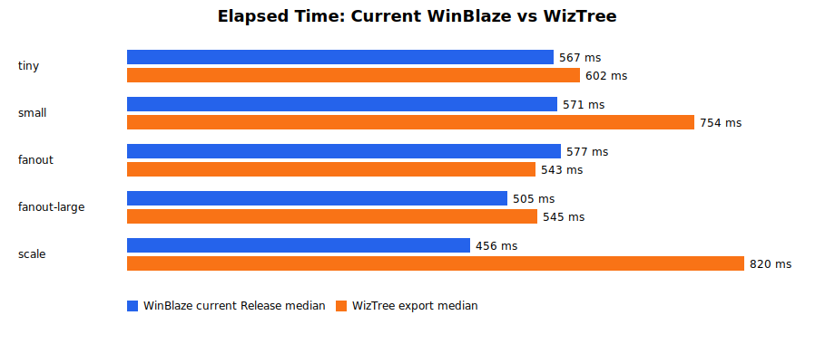
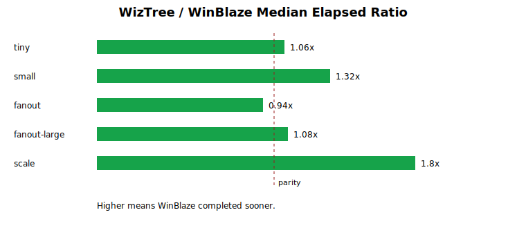

# Performance Comparison Report

Generated: 2026-05-19T00:56:56.5586363Z
Previous comparison: 2026-05-18T12:27:51.1551721Z

## Summary

- Versus the previous saved WinBlaze medians, 1 profiles improved and 4 regressed.
- WinBlaze beat WizTree on 4 of 5 measured generated profiles; WizTree beat WinBlaze on 1.
- Best relative WinBlaze result: scale, 1.8x faster by median elapsed time.
- WinDirStat is still listed as installed but was not timed automatically because this environment lacks a reliable completion/export signal for comparable unattended runs.

## Methodology

- WinBlaze: `benchmarks\run-release-baseline-set.ps1 -Profiles tiny,small,fanout,fanout-large,scale -Runs 3 -GenerateDatasets`, Release UI build.
- WizTree: `WizTree64.exe <dataset-root> /export=<csv>`, three runs per dataset; elapsed time is process lifetime until CSV export completes.
- Delta compares the current WinBlaze median with the previous saved comparison report. Negative is faster.
- Ratio = WizTree median elapsed / WinBlaze median elapsed. Higher than 1.0 means WinBlaze completed sooner.

## Tools

| Tool | Installed | Version | Path |
|---|---:|---|---|
| WizTree | True | 4.31 | C:\Program Files\WizTree\WizTree64.exe |
| WinDirStat | True | 2.6.0 | C:\Program Files\WinDirStat\WinDirStat.exe |
| Everything | False | n/a | n/a |

## Results

| Profile | Files | Dirs | Previous WinBlaze median ms | Current WinBlaze median ms | Delta | WizTree median ms | WizTree runs ms | Ratio | Working set MB | Peak frame ms | Peak flush ms |
|---|---:|---:|---:|---:|---:|---:|---|---:|---:|---:|---:|
| tiny | 72 | 13 | 505 | 567 | 62 ms (12.3%) | 602 | 780, 574, 602 | 1.06x | 173.4 | 16 | 14 |
| small | 1536 | 73 | 499 | 571 | 72 ms (14.4%) | 754 | 754, 754, 755 | 1.32x | 181.5 | 12 | 33 |
| fanout | 2048 | 3 | 529 | 577 | 48 ms (9.1%) | 543 | 549, 543, 535 | 0.94x | 184.5 | 14 | 32 |
| fanout-large | 8192 | 3 | 487 | 505 | 18 ms (3.7%) | 545 | 528, 545, 560 | 1.08x | 202 | 14 | 69 |
| scale | 16384 | 545 | 459 | 456 | -3 ms (-0.7%) | 820 | 820, 801, 913 | 1.8x | 204.7 | 12 | 69 |

## Charts

## Notes

- These measurements are still not perfectly equivalent: WinBlaze measures UI-ready results, while WizTree measures command-line CSV export completion.
- Generated dataset timings are dominated by app launch, UI readiness, export setup, filesystem cache state, and process startup overhead at the smaller sizes.
- Raw data: `benchmarks\performance-comparison-data.json`, `benchmarks\winblaze-release-medians.json`, and `benchmarks\competitor-timings-wiztree.json`.
